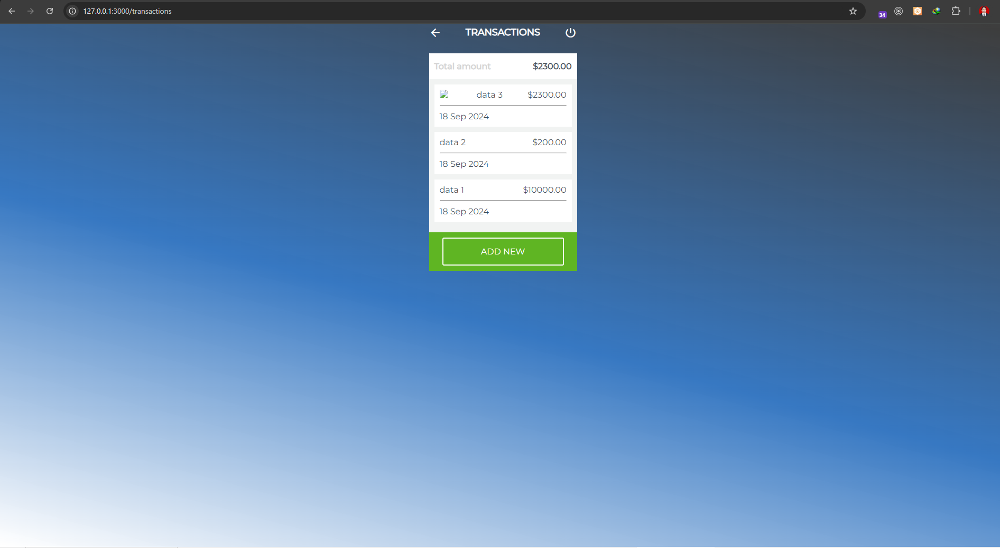

<h1 align="center">
  <a href="https://github.com/Alamnzr123/starterpack_rails">
  Wallet Application
  </a>
  <br />
</h1>



**Wallet** is application built on top of Rails and fully coded in **Ruby on Rails**.Simplify wallet with feature add transaction, login, register, logout and authentication.

## Getting Started

This is a [Ruby on Rails](https://rubyonrails.org/) project with [`gem rails application_name`](https://guides.rubyonrails.org/getting_started.html).

First, Install Depedency:

```bash
gem install
```

Second, run the development server:

```bash
ruby bin/rails server
```

Open [http://127.0.0.1:3000/](http://127.0.0.1:3000/) with your browser to see the result.

You can start editing the page by modifying `app`. The page auto-updates as you edit the file.


## How run Database using Console

- run `ruby bin/rails console`


